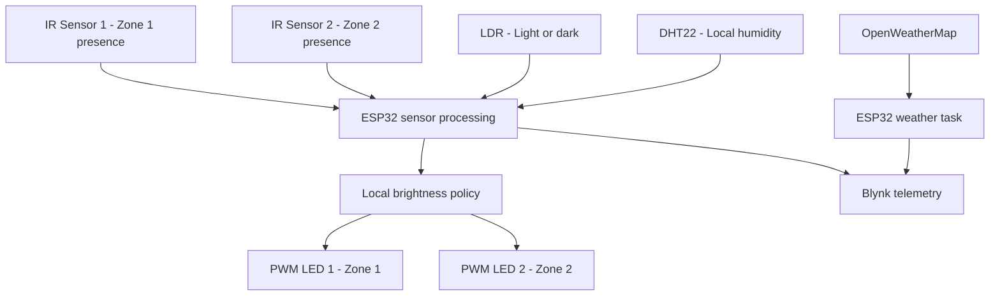
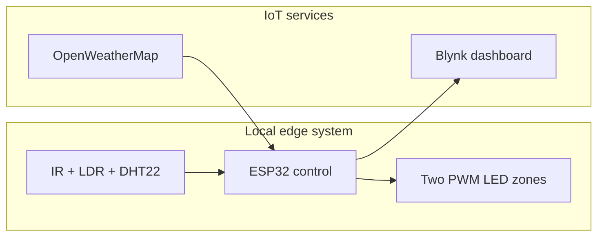
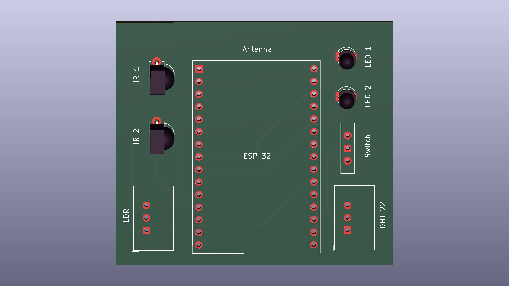

<div align="center">

# 🌆 IoT-Based Smart Adaptive Street Lighting System

### ESP32 sensor fusion, adaptive two-zone lighting, IoT telemetry, and custom PCB design

[](LICENSE)
[](HARDWARE_LICENSE.txt)
[](MEDIA_LICENSE.md)


An ESP32-based proof-of-concept that adjusts two model street-light zones using object presence, ambient light, and local humidity. It reports live system information through Blynk and includes a custom schematic, PCB layout, and Gerber/drill fabrication export.

<p>
  <a href="#readme-overview">Overview</a> ·
  <a href="#readme-prototype">Working prototype</a> ·
  <a href="#readme-operation">System operation</a> ·
  <a href="#readme-hardware-design">Hardware design</a> ·
  <a href="#readme-fabrication">Fabrication files</a> ·
  <a href="#readme-getting-started">Getting started</a> ·
  <a href="#readme-licensing">Licensing</a> ·
  <a href="#readme-developer">Developer</a>
</p>

</div>

---

<a name="readme-overview"></a>

## 👀 Project at a Glance

Conventional street lights commonly operate at fixed output even when roads are empty or daylight is sufficient. This prototype demonstrates a more responsive approach. Two lighting zones are adjusted independently using local sensor readings, while the ESP32 communicates live measurements and operating decisions to an IoT dashboard.

### What the project demonstrates

- **Two independently controlled street-light zones**
- **Object-presence sensing** with two active-low IR modules
- **Automatic light/dark detection** using a digital LDR module
- **Local temperature and humidity measurement** using a DHT22
- **Humidity-based visibility assistance profiles**
- **12-bit PWM LED brightness control**
- **Live Blynk telemetry and status reporting**
- **OpenWeatherMap information display**
- **Custom schematic capture and PCB layout**
- **Corrected two-layer Gerber and drill-file fabrication package**
- **Serial output for testing and debugging**

> [!IMPORTANT]
> The DHT22 measures relative humidity rather than fog or visibility directly. The current prototype uses local humidity as a simple fog/visibility-condition approximation. OpenWeatherMap information is displayed through Blynk but does not currently determine LED brightness.

---

<a name="readme-prototype"></a>

## 📸 Working Prototype

The physical proof-of-concept represents a two-zone roadway with two lamp posts, an ESP32 controller, sensor modules, and prototype wiring.

<table>
  <tr>
    <td width="50%" align="center">
      
      <br><strong>Prototype — front perspective</strong>
    </td>
    <td width="50%" align="center">
      
      <br><strong>Prototype — top perspective</strong>
    </td>
  </tr>
</table>

---

<a name="readme-operation"></a>

## 🧠 How It Works



1. The **LDR module** identifies bright and dark surroundings through an adjustable digital threshold.
2. Two **IR sensor modules** detect nearby objects independently in Zone 1 and Zone 2.
3. The **DHT22** measures local temperature and relative humidity.
4. The ESP32 combines the sensor states and selects a PWM duty level for each LED zone.
5. Local readings and the chosen lighting decision are sent to **Blynk**.
6. **OpenWeatherMap** information is retrieved and displayed as additional monitoring context.

### Active-low input behaviour

| Sensor input | Value `0` | Value `1` |
|---|---|---|
| IR Sensor 1 | Object detected | No object detected |
| IR Sensor 2 | Object detected | No object detected |
| Digital LDR module | Bright/light detected | Dark/light not detected |

---

## 💡 Adaptive Brightness Logic

The firmware evaluates three local-humidity ranges together with the LDR and both IR inputs. This creates 24 sensor combinations.

The following table summarizes the per-zone policy. PWM values use a 12-bit scale from `0` to `4095`.

| Local humidity | Environment | Zone without an object | Zone with an object | Operating profile |
|---|---|---:|---:|---|
| Above 95% | Dark | `1500` | `2500` | High-humidity night profile |
| Above 95% | Bright | `2500` | `4000` | High-humidity daytime profile |
| Above 80% to 95% | Dark | `300` | `1200` | Medium-humidity night profile |
| Above 80% to 95% | Bright | `1200` | `2800` | Medium-humidity daytime profile |
| 80% or below | Dark | `50` | `1200` | Normal night profile |
| 80% or below | Bright | `0` | `0` | Normal bright-environment profile |

Under normal bright conditions, both model lights remain off. At night, an unoccupied zone remains at a low duty level and the relevant zone becomes brighter after object detection. The higher-humidity profiles provide experimentally increased illumination.

---

## 🧩 System Architecture



The lighting decision is performed on the ESP32. The present Blynk integration reports telemetry and decisions; the firmware does not contain `BLYNK_WRITE(...)` callbacks for cloud-based lamp actuation.

---

<a name="readme-hardware-design"></a>

## 🧱 Electronic and PCB Design

The repository now documents the hardware at three levels: the original connection diagram, an electronic schematic, and a PCB-layout preview.

### Electronic schematic

<div align="center">
  
  <br><em>ESP32, two IR inputs, LDR input, DHT22 data connection, power switch, and two LED outputs.</em>
</div>

### PCB layout preview

<div align="center">
  
  <br><em>Two-layer controller-board preview showing the ESP32 headers, sensor connections, switch, LED positions, routing, and antenna area.</em>
</div>

### Prototype connection diagram

<div align="center">
  
</div>

### GPIO connection map

| ESP32 GPIO | Connected component | Function |
|---:|---|---|
| `GPIO 12` | IR Sensor Module 1 | Zone 1 object-presence input |
| `GPIO 13` | IR Sensor Module 2 | Zone 2 object-presence input |
| `GPIO 35` | LDR sensor module | Digital light/dark input |
| `GPIO 4` | DHT22 module | Local temperature and humidity data |
| `GPIO 26` | LED 1 | Zone 1 PWM output |
| `GPIO 25` | LED 2 | Zone 2 PWM output |

> [!NOTE]
> The legacy names `IR1`, `IR2`, `LED1`, and `LED2` in the current sketch are not fully aligned with the visible zone numbering. The GPIO values in this table describe the physical schematic and should be treated as the wiring reference.

> [!CAUTION]
> This is a low-voltage proof-of-concept controller. Confirm ESP32-compatible signal levels and independently review the schematic, PCB rules, clearances, footprints, orientation, power distribution, and manufacturer preview before assembly. Real street lamps or high-power LEDs require a suitable protected driver stage and separate power source.

---

<a name="readme-fabrication"></a>

## 🏭 PCB Fabrication Package

The [`PCB Fabrication`](./PCB%20Fabrication/) folder contains the corrected, focused set of Gerber, Excellon drill, and Gerber job outputs for the controller board. The package no longer includes unrelated design-documentation layers: it contains the files needed to describe the present two-layer, through-hole PCB.

### Package audit at a glance

| Checked item | Result from the current files |
|---|---|
| PCB design tool | KiCad Pcbnew 10.0.2 |
| Board construction | Two copper layers; nominal 1.6 mm thickness |
| Board size in job metadata | 55.05 mm × 49.05 mm |
| Closed edge profile | Nominal 55 mm × 49 mm rectangular outline |
| Outer copper thickness in metadata | 0.035 mm per layer |
| Reported minimum track/clearance rule | 0.2 mm |
| Surface finish | Not fixed in the export; select the preferred finish when ordering |
| Plated drilling | 49 hole positions using 0.80 mm and 0.90 mm tools |
| Non-plated drilling | NPTH file is included and contains no hole positions, matching a design with no NPTH features |
| Job-file consistency | Project name, board size, layer functions, and referenced filenames agree with the uploaded package |

### Included production files

| Output | Purpose |
|---|---|---|
| `*-F_Cu.gbr` | Top copper routing and pads |
| `*-B_Cu.gbr` | Bottom copper routing and pads |
| `*-F_Mask.gbr` | Top solder-mask openings |
| `*-B_Mask.gbr` | Bottom solder-mask openings |
| `*-F_Silkscreen.gbr` | Top component labels and board markings |
| `*-Edge_Cuts.gbr` | Closed board outline |
| `*-PTH.drl` | Plated through-hole drill coordinates |
| `*-NPTH.drl` | Non-plated drill output; intentionally has no hole coordinates in this revision |
| `*-job.gbrjob` | Gerber X2 layer mapping, board metadata, and stack-up information |

The present board uses a top legend and through-hole assembly. A bottom-silkscreen file and solder-paste/stencil files are therefore not part of this release.

### What was verified

- The Gerber file attributes correctly identify top/bottom copper, top/bottom solder mask, top legend, and the non-plated profile.
- The Gerber job file points to the files that actually exist in the folder.
- The edge-cut data forms a closed rectangular board profile and agrees with the reported board dimensions.
- The PTH drill output contains the two drill sizes used by the current footprints.
- The folder contains only the required outputs for this revision.
- The component and footprint choices have been manually checked by the project developer against the physical project.

This is a package-level consistency review, not a substitute for the selected manufacturer's automated production checks. A final Gerber-viewer review remains normal practice for every PCB order, including previously fabricated designs.

### Simple fabrication workflow

1. Open every Gerber and drill file together in KiCad Gerber Viewer or the chosen manufacturer's online viewer.
2. Confirm the outline, dimensions, copper, mask openings, top markings, and drill positions shown in the preview.
3. Upload the fabrication files as a ZIP if the manufacturer requires a single archive.
4. Choose the board options that agree with the design metadata, such as two layers and 1.6 mm thickness.
5. Inspect the manufacturer's final rendered preview before confirming the order.

The folder-level fabrication instructions are available in [`PCB Fabrication/README.md`](./PCB%20Fabrication/README.md).

### Editable design sources

The current public repository contains clear PNG previews and the generated fabrication package. Adding the editable KiCad project files in a future release would also allow other developers to modify the board directly:

```text
*.kicad_pro
*.kicad_sch
*.kicad_pcb
```

Local history, lock, and user-session files such as `.history/`, `*.lck`, and `*.kicad_prl` can remain excluded.

---

## 🛠️ Hardware

| Quantity | Component | Purpose |
|---:|---|---|
| 1 | ESP32 development board, 30-pin | Processing, PWM control, Wi-Fi, and IoT communication |
| 2 | IR obstacle/proximity modules | Independent object detection for two zones |
| 1 | Digital LDR module | Adjustable light/dark threshold detection |
| 1 | DHT22 module | Local temperature and humidity measurement |
| 2 | Low-power LEDs | Model street-light outputs |
| 1 | Power switch | Physical supply switching |
| 1 | Prototype board or fabricated PCB | Electrical interconnection |
| 1 | USB cable and suitable supply | ESP32 programming and power |
| 1 | Road model with two lamp posts | Visual demonstration platform |

---

## ☁️ Blynk Dashboard Mapping

| Virtual pin | Data sent by the firmware |
|---|---|
| `V0` | Local DHT22 temperature |
| `V1` | Local DHT22 humidity |
| `V2` | Two IR states and the LDR state |
| `V3` | OpenWeatherMap temperature, humidity, and description |
| `V4` | Human-readable lighting decision/status message |

Suggested datastream types:

- `V0` and `V1`: Double
- `V2`, `V3`, and `V4`: String

---

## 🧾 Firmware

The ESP32 application is provided in [`System Code.ino`](./System%20Code.ino).

### Main firmware responsibilities

- Read active-low IR and LDR inputs
- Read local DHT22 temperature and humidity
- Apply the 24-state adaptive-brightness policy
- Generate two 12-bit PWM outputs at 19 kHz
- Publish measurements and decisions to Blynk
- Retrieve and display OpenWeatherMap context
- Print diagnostic information at `115200` baud

### Required software and libraries

- [Arduino IDE](https://www.arduino.cc/en/software)
- ESP32 board package by Espressif Systems
- [Blynk library](https://github.com/blynkkk/blynk-library)
- [ArduinoJson](https://github.com/bblanchon/ArduinoJson)
- DHT sensor library and its required sensor dependency
- `WiFi.h` and `HTTPClient.h`, supplied by the ESP32 Arduino core

The sketch uses the newer ESP32 LEDC attachment API. Record the exact ESP32 board-package version used for successful compilation and testing.

---

<a name="readme-getting-started"></a>

## 🚀 Getting Started

<details>
<summary><strong>Open the complete installation, configuration, upload, and test guide</strong></summary>

### 1. Clone the repository

```bash
git clone https://github.com/Agnibha-31/IoT-based-Smart-Adaptive-Street-Lighting-System.git
cd IoT-based-Smart-Adaptive-Street-Lighting-System
```

### 2. Install the firmware tools

1. Install Arduino IDE.
2. Add the ESP32 board package through **Boards Manager**.
3. Install Blynk, ArduinoJson, and the DHT sensor libraries through **Library Manager**.
4. Select the appropriate ESP32 board and serial port.

### 3. Configure Blynk

Create a Blynk template and device, then configure virtual datastreams `V0`–`V4` using the mapping above.

### 4. Configure private values locally

The public sketch masks these private or installation-specific values:

- Blynk authentication token
- Wi-Fi SSID
- Wi-Fi password
- OpenWeatherMap city
- OpenWeatherMap API key

Insert personal values only in a local development copy. Never commit active credentials to the public repository. A future code revision should move these values into a gitignored `secrets.h` file and provide only `secrets.example.h` publicly.

> [!TIP]
> If any real credential was committed in an earlier revision, rotate or revoke it even after replacing it in the latest file. Git history can retain earlier values.

### 5. Compile and upload

1. Open [`System Code.ino`](./System%20Code.ino) in Arduino IDE.
2. Compile the sketch.
3. Connect the ESP32 through USB.
4. Select the correct board and port.
5. Upload the firmware.
6. Open Serial Monitor at `115200` baud.

### 6. Test the prototype

- Change the LDR input between bright and dark conditions.
- Trigger each IR module independently.
- Confirm that the related LED zone changes brightness.
- Verify local DHT22 temperature and humidity values.
- Confirm that Blynk datastreams `V0`–`V4` update correctly.

</details>

---

## 📁 Repository Contents

```text
IoT-based-Smart-Adaptive-Street-Lighting-System/
├── README.md
├── LICENSE
├── HARDWARE_LICENSE.txt
├── MEDIA_LICENSE.md
├── NOTICE
├── System Code.ino
├── Circuit Design.png
├── Circuit Schematic.png
├── PCB.png
├── Prototype Img 1.jpg
├── Prototype Img 2.jpg
└── PCB Fabrication/
    ├── README.md
    ├── *-F_Cu.gbr / *-B_Cu.gbr
    ├── *-F_Mask.gbr / *-B_Mask.gbr
    ├── *-F_Silkscreen.gbr
    ├── *-Edge_Cuts.gbr
    ├── *-PTH.drl / *-NPTH.drl
    └── *-job.gbrjob
```

| File or folder | Description |
|---|---|
| [`System Code.ino`](./System%20Code.ino) | ESP32 firmware for sensing, adaptive PWM control, Blynk telemetry, and weather retrieval |
| [`Circuit Design.png`](./Circuit%20Design.png) | Prototype connection diagram |
| [`Circuit Schematic.png`](./Circuit%20Schematic.png) | Electronic schematic image |
| [`PCB.png`](./PCB.png) | Corrected PCB-layout preview image |
| [`PCB Fabrication/`](./PCB%20Fabrication/) | Corrected Gerber layers, PTH/NPTH drill outputs, job metadata, and fabrication notes |
| [`Prototype Img 1.jpg`](./Prototype%20Img%201.jpg) | Front-perspective prototype photograph |
| [`Prototype Img 2.jpg`](./Prototype%20Img%202.jpg) | Top-perspective prototype photograph |
| [`LICENSE`](./LICENSE) | Apache License 2.0 for firmware/source code |
| [`HARDWARE_LICENSE.txt`](./HARDWARE_LICENSE.txt) | CERN-OHL-P-2.0 for hardware-design material |
| [`MEDIA_LICENSE.md`](./MEDIA_LICENSE.md) | CC BY 4.0 notice for photographs and written documentation |

---

## ✅ Current Scope

| Capability | Status |
|---|---|
| Local two-zone adaptive lighting | ✅ Implemented |
| IR object-presence sensing | ✅ Implemented |
| Digital ambient-light sensing | ✅ Implemented |
| Local temperature/humidity monitoring | ✅ Implemented |
| Blynk telemetry and status reporting | ✅ Implemented |
| OpenWeatherMap information display | ✅ Implemented |
| Electronic schematic image | ✅ Included |
| Corrected PCB-layout preview | ✅ Included |
| Focused Gerber and drill-file fabrication package | ✅ Corrected and included |
| Editable KiCad project source | 🧭 Recommended addition |
| True vehicle counting or traffic-density estimation | 🧭 Future enhancement |
| Direct fog/visibility measurement | 🧭 Future enhancement |
| Blynk-based remote lamp actuation | 🧭 Future enhancement |
| Historical database and analytics | 🧭 Future enhancement |
| Lamp-fault/current monitoring | 🧭 Future enhancement |
| Measured energy-saving study | 🧭 Future validation |
| Production-grade street-lamp power stage | 🧭 Future hardware stage |

---

## 🌱 Present Prototype Boundaries

<details>
<summary><strong>Open the current boundaries and future engineering opportunities</strong></summary>

This release demonstrates the complete proof-of-concept workflow while keeping the following areas open for future development:

- The IR modules report local object presence; vehicle counting and traffic-density calculation are possible future extensions.
- Relative humidity is used as an environmental approximation rather than as a direct fog or optical-visibility measurement.
- OpenWeatherMap information is displayed for context and is not yet part of the LED-control decision.
- Blynk provides monitoring in the current firmware; remote actuator callbacks can be added in a later release.
- Wi-Fi recovery, HTTPS weather access, JSON validation, DHT read validation, and retry/backoff can be strengthened for longer unattended operation.
- A controlled power-measurement study can be added to quantify energy savings.
- The repository currently shares rendered hardware designs and production outputs; editable KiCad sources would provide an additional path for direct modification.
- As with any PCB release, the chosen manufacturer's final Gerber preview and production settings should be reviewed before ordering.

</details>

---

## 🗺️ Roadmap

<details>
<summary><strong>Open the suggested development roadmap</strong></summary>

- [ ] Align all firmware constant names with the physical zone numbering
- [ ] Refactor the repeated 24-state branches into reusable policy functions
- [ ] Add offline-first operation and non-blocking Wi-Fi reconnection
- [ ] Move credentials into a gitignored secrets file
- [ ] Add HTTPS weather retrieval, rate limiting, and robust error handling
- [ ] Add editable KiCad project sources
- [ ] Run and document schematic ERC and PCB DRC results
- [ ] Publish future PCB revisions with versioned fabrication release notes
- [ ] Add a dedicated visibility sensor or validated sensor-fusion method
- [ ] Add current and power sensing for measured energy analysis
- [ ] Add historical telemetry and charts
- [ ] Add per-zone lamp-fault detection
- [ ] Add a protected driver stage for higher-power loads
- [ ] Add automated control-logic tests

</details>

---

<a name="readme-licensing"></a>

## 📜 Licensing

This repository uses a clear license for each type of work:

| Repository material | License |
|---|---|
| ESP32 firmware and other software source | [Apache License 2.0](LICENSE) |
| Original circuit, schematic, PCB design, Gerber, drill, job, and future editable KiCad files | [CERN Open Hardware Licence Version 2 — Permissive](HARDWARE_LICENSE.txt) |
| Original prototype photographs and written documentation | [Creative Commons Attribution 4.0 International](MEDIA_LICENSE.md) |

Third-party libraries, trademarks, product names, logos, KiCad/Fritzing assets, symbols, footprints, fonts, icons, and component artwork remain subject to their respective owners' terms.

The hardware files are shared as open design material so that others can study, reproduce, and improve the work under the stated license. Builders should still select suitable manufacturing options and review the final production preview for their intended use.

---

<a name="readme-developer"></a>

## 👨‍💻 Developer

### [Agnibha Basak](https://github.com/Agnibha-31)

For IoT development, embedded systems, automation, PCB design, technical collaboration, or business enquiries, mail at: [remix.play31@gmail.com](https://mail.google.com/mail/?view=cm&fs=1&to=remix.play31@gmail.com&su=Smart%20Meter%20IoT%20Dashboard%20Enquiry)
