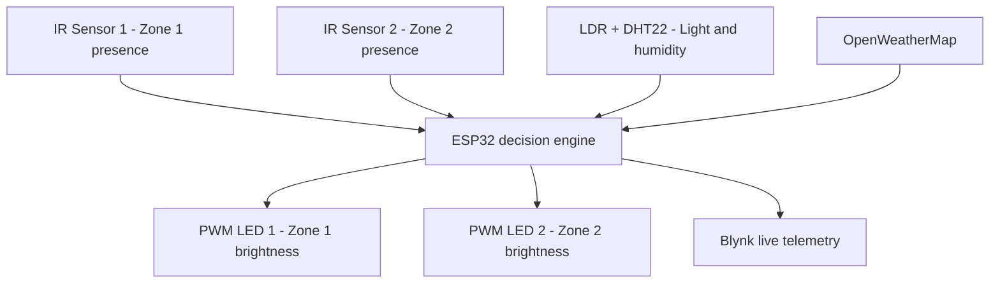
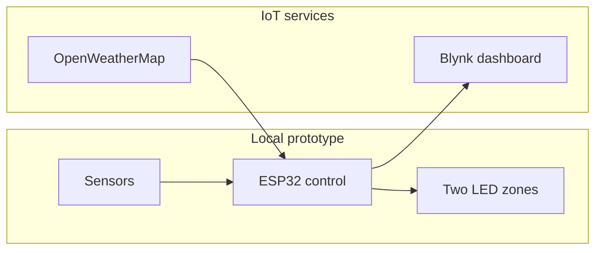

<div align="center">

# 🌆 IoT-Based Smart Adaptive Street Lighting System

### ESP32-powered, sensor-aware, two-zone lighting with live IoT monitoring

[](LICENSE)
[](MEDIA_LICENSE.md)


An ESP32 proof-of-concept that automatically adjusts two model street-light zones using object presence, ambient light, and local humidity, while reporting live sensor values and operating decisions through Blynk.

[Explore the code](#-firmware) · [See the circuit](#-circuit-design) · [Build the project](#-getting-started) · [Contact the developer](#-developer)

</div>

---

## 👀 Project at a Glance

Traditional street lights often operate at fixed brightness even when roads are empty or sufficient daylight is available. This prototype demonstrates a more responsive approach: each model-road zone changes brightness according to nearby object presence, light conditions, and a local humidity-based visibility profile.

### What the system demonstrates

- **Two independently controlled lighting zones**
- **Object-presence detection** using two active-low IR sensor modules
- **Automatic light/dark detection** using a digital LDR module
- **Local temperature and humidity sensing** using a DHT22
- **12-bit PWM brightness control** for two LEDs
- **Live Blynk telemetry** for sensor values and lighting decisions
- **OpenWeatherMap information** displayed as additional remote context
- **Serial monitoring** for testing and debugging

> [!IMPORTANT]
> The DHT22 measures humidity, not fog or visibility directly. In the present prototype, local humidity is used as a simple visibility-condition approximation. OpenWeatherMap data is displayed in Blynk but does not control the LEDs.

---

## 📸 Working Prototype

The physical model represents a two-zone roadway with two lamp posts, an ESP32 controller, sensor modules, and breadboard wiring.

<table>
  <tr>
    <td width="50%" align="center">
      
      <br><strong>Prototype — front perspective</strong>
    </td>
    <td width="50%" align="center">
      
      <br><strong>Prototype — top perspective</strong>
    </td>
  </tr>
</table>

---

## 🧠 How It Works



1. The **LDR module** determines whether the surroundings are bright or dark.
2. The two **IR modules** independently detect nearby objects in Zone 1 and Zone 2.
3. The **DHT22** measures local temperature and humidity.
4. The ESP32 selects a PWM duty level for each lighting zone.
5. Sensor readings and the selected operating state are sent to **Blynk**.
6. **OpenWeatherMap** data is fetched and displayed as contextual information.

### Active-low sensor behaviour

| Sensor input | Value `0` | Value `1` |
|---|---|---|
| IR Sensor 1 | Object detected | No object detected |
| IR Sensor 2 | Object detected | No object detected |
| Digital LDR module | Bright/light detected | Dark/light not detected |

---

## 💡 Adaptive Brightness Logic

The firmware evaluates three local-humidity ranges together with the light condition and both IR inputs. This creates 24 possible sensor combinations.

The table below summarizes the per-zone PWM policy. PWM values use a 12-bit scale from `0` to `4095`.

| Local humidity | Environment | Zone without an object | Zone with an object | Operating profile |
|---|---|---:|---:|---|
| Above 95% | Dark | `1500` | `2500` | High-humidity night profile |
| Above 95% | Bright | `2500` | `4000` | High-humidity daytime profile |
| Above 80% to 95% | Dark | `300` | `1200` | Medium-humidity night profile |
| Above 80% to 95% | Bright | `1200` | `2800` | Medium-humidity daytime profile |
| 80% or below | Dark | `50` | `1200` | Normal night profile |
| 80% or below | Bright | `0` | `0` | Normal bright-environment profile |

The prototype therefore keeps normal daytime lighting off, maintains a low night-time level when a zone is empty, and increases the relevant zone when an object is detected. Higher-humidity profiles use stronger output as an experimental visibility-assistance strategy.

---

## 🧩 System Architecture



The lighting decision is performed on the ESP32. Cloud services support monitoring and weather display; the current firmware does not contain Blynk callbacks for remote lamp switching.

---

## 🔌 Circuit Design

<div align="center">
  
</div>

### GPIO connection map

| ESP32 GPIO | Connected component | Function |
|---:|---|---|
| `GPIO 12` | IR Sensor Module 1 | Zone 1 object-presence input |
| `GPIO 13` | IR Sensor Module 2 | Zone 2 object-presence input |
| `GPIO 35` | LDR sensor module | Digital light/dark input |
| `GPIO 4` | DHT22 module | Local temperature and humidity data |
| `GPIO 26` | LED 1 | Zone 1 PWM output |
| `GPIO 25` | LED 2 | Zone 2 PWM output |

> [!CAUTION]
> The diagram documents the proof-of-concept signal paths. When recreating it, use a suitable **220–330 Ω series resistor for each low-power LED** and verify that every signal entering the ESP32 remains within its **3.3 V GPIO limit**. Real street lamps or high-power LEDs require a protected MOSFET/constant-current driver and a separate power supply; they must never be powered directly from an ESP32 pin.

> [!NOTE]
> The historical names `IR1`, `IR2`, `LED1`, and `LED2` inside the current sketch are not fully aligned with the visible module numbering. Treat the GPIO table above as the physical wiring reference when reviewing the present version.

---

## 🛠️ Hardware

| Quantity | Component | Purpose |
|---:|---|---|
| 1 | ESP32 development board, 30-pin | Processing, PWM control, Wi-Fi, and IoT communication |
| 2 | IR obstacle/proximity sensor modules | Independent object detection for two zones |
| 1 | Digital LDR sensor module | Adjustable light/dark threshold detection |
| 1 | DHT22 module | Local temperature and humidity measurement |
| 2 | Low-power LEDs | Model street-light outputs |
| 2 | 220–330 Ω resistors | LED current limiting |
| 1 | Breadboard | Prototype interconnection |
| 1 set | Jumper wires | Signal, power, and ground connections |
| 1 | Switch | Physical power switching |
| 1 | USB cable and suitable supply | ESP32 programming and power |
| 1 | Road model with two lamp posts | Visual demonstration platform |

---

## ☁️ Blynk Dashboard Mapping

The firmware sends the following information to Blynk:

| Virtual pin | Data |
|---|---|
| `V0` | Local DHT22 temperature |
| `V1` | Local DHT22 humidity |
| `V2` | Two IR states and LDR state |
| `V3` | OpenWeatherMap temperature, humidity, and description |
| `V4` | Human-readable lighting decision/status message |

Suggested Blynk datastream types:

- `V0` and `V1`: Double
- `V2`, `V3`, and `V4`: String

---

## 💻 Software and Libraries

- [Arduino IDE](https://www.arduino.cc/en/software)
- ESP32 board package by Espressif Systems
- [Blynk library](https://github.com/blynkkk/blynk-library)
- [ArduinoJson](https://github.com/bblanchon/ArduinoJson)
- DHT sensor library and its required sensor dependency
- `WiFi.h` and `HTTPClient.h`, supplied by the ESP32 Arduino core

The sketch uses the newer ESP32 LEDC attachment API. Record and use the ESP32 board-package version with which the firmware is successfully tested.

---

## 🚀 Getting Started

### 1. Clone the repository

```bash
git clone https://github.com/Agnibha-31/IoT-based-Smart-Adaptive-Street-Lighting-System.git
cd IoT-based-Smart-Adaptive-Street-Lighting-System
```

### 2. Install the development tools

1. Install Arduino IDE.
2. Add the ESP32 board package through **Boards Manager**.
3. Install Blynk, ArduinoJson, and the DHT sensor libraries through **Library Manager**.
4. Select the appropriate ESP32 board and serial port.

### 3. Create the Blynk configuration

Create a Blynk template and device, then configure virtual datastreams `V0`–`V4` using the mapping above.

### 4. Configure private values locally

The public sketch intentionally masks the following values:

- Blynk authentication token
- Wi-Fi SSID
- Wi-Fi password
- OpenWeatherMap city
- OpenWeatherMap API key

Insert your own values only in your local development copy. Never commit real credentials to a public repository. A stronger implementation is to move them into a gitignored `secrets.h` file and commit only a `secrets.example.h` template.

### 5. Upload the firmware

1. Open [`System Code.ino`](./System%20Code.ino) in Arduino IDE.
2. Compile the sketch.
3. Connect the ESP32 through USB.
4. Select the correct board and port.
5. Upload the firmware.
6. Open Serial Monitor at `115200` baud.

### 6. Test the prototype

- Cover and uncover the LDR module or adjust its threshold.
- Trigger each IR module independently.
- Confirm that only the relevant LED zone changes brightness.
- Verify local temperature and humidity readings.
- Check that `V0`–`V4` update in Blynk.

---

## 📁 Repository Contents

```text
IoT-based-Smart-Adaptive-Street-Lighting-System/
├── README.md
├── LICENSE
├── MEDIA_LICENSE.md
├── NOTICE
├── System Code.ino
├── Circuit Design.png
├── Prototype Img 1.jpg
└── Prototype Img 2.jpg
```

| File | Description |
|---|---|
| [`System Code.ino`](./System%20Code.ino) | ESP32 firmware containing sensor reading, adaptive PWM logic, Blynk telemetry, and weather retrieval |
| [`Circuit Design.png`](./Circuit%20Design.png) | Complete prototype connection diagram |
| [`Prototype Img 1.jpg`](./Prototype%20Img%201.jpg) | Front-perspective photograph of the physical model |
| [`Prototype Img 2.jpg`](./Prototype%20Img%202.jpg) | Top-perspective photograph of the physical model |
| [`LICENSE`](./LICENSE) | Apache License 2.0 for source code |
| [`MEDIA_LICENSE.md`](./MEDIA_LICENSE.md) | CC BY 4.0 notice for original media and documentation |

---

## ✅ Current Scope

| Capability | Status |
|---|---|
| Local two-zone adaptive lighting | ✅ Implemented |
| IR object-presence sensing | ✅ Implemented |
| Digital ambient-light sensing | ✅ Implemented |
| Local temperature/humidity monitoring | ✅ Implemented |
| Blynk telemetry and status reporting | ✅ Implemented |
| OpenWeatherMap information display | ✅ Implemented |
| True vehicle counting or traffic-density estimation | 🧭 Future enhancement |
| Dedicated fog/visibility measurement | 🧭 Future enhancement |
| Blynk-based remote actuation | 🧭 Future enhancement |
| Historical database and analytics | 🧭 Future enhancement |
| Lamp-fault/current monitoring | 🧭 Future enhancement |
| Measured energy-saving study | 🧭 Future validation |
| Production-grade street-lamp driver | 🧭 Future hardware stage |

---

## ⚠️ Known Limitations

- IR modules indicate local object presence; they do not count vehicles or measure traffic density.
- Relative humidity is only an approximate environmental indicator and is not a direct fog/visibility measurement.
- OpenWeatherMap data is displayed but is not part of the current brightness decision.
- The current network connection sequence should be extended with timeout, retry, and offline operation.
- Weather requests should use HTTPS, response validation, error backoff, and a longer polling interval.
- DHT22 reads should be checked for `NaN` before they enter the decision logic.
- Quantified energy savings have not yet been established through power measurements.
- The prototype controls small LEDs, not mains-powered or high-power street lamps.

---

## 🗺️ Roadmap

- [ ] Refactor the 24 repeated decision branches into reusable policy functions
- [ ] Align all firmware constant names with the two physical zones
- [ ] Add offline-first operation and non-blocking Wi-Fi reconnection
- [ ] Move private configuration into a gitignored secrets file
- [ ] Add HTTPS weather retrieval with rate limiting and robust error handling
- [ ] Add a dedicated visibility sensor or validated sensor-fusion method
- [ ] Add current and power sensing for measured energy analysis
- [ ] Add historical telemetry and charts
- [ ] Add per-zone lamp-fault detection
- [ ] Add a protected driver stage for higher-power LED loads
- [ ] Add automated control-logic tests

---

## 📜 License

Source code in this repository is licensed under the [Apache License 2.0](LICENSE).

Original project photographs, circuit imagery, and written documentation are licensed under [Creative Commons Attribution 4.0 International](MEDIA_LICENSE.md), unless a file states otherwise. Third-party libraries, trademarks, product names, logos, and component artwork remain subject to their respective owners' terms.

---

## 👨‍💻 Developer

Developed by **Agnibha Basak**.

For project development, IoT systems, embedded solutions, automation, technical collaboration, or business enquiries, contact:

📧 [remix.play31@gmail.com](mailto:remix.play31@gmail.com?subject=IoT%20Smart%20Adaptive%20Street%20Lighting%20Project%20Enquiry)
